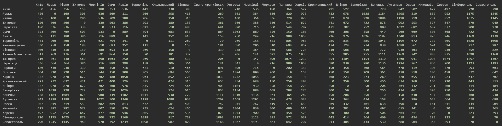

# GoITNeo Algo HW-6

## Task1
Create a graph using the ```NetworkX``` library to model a specific real-world network (such as a city's transportation network, social network, internet topology).
Visualize the created graph and make an analysis of its key characteristics (e.g., number of nodes and edges, node degrees).

### Solution
Let's make a graph of Ukraine's main cities and their roads. We will add attribute "pos" to locate each city on it's proper place.
We made a class ```UkraineRoads``` in file main.py.
So, we have printed information about and a picture of the graph:
```
Number of cities: 26
Number of roads: 54
Centrality:
  Київ             0.32
  Луцьк            0.12
  Рівне            0.2
  Житомир          0.16
  Чернігів         0.04
  Суми             0.12
  Львів            0.2
  Тернопіль        0.28
  Хмельницький     0.2
  Вінниця          0.16
  Івано-Франківськ 0.16
  Ужгород          0.12
  Чернівці         0.12
  Черкаси          0.12
  Полтава          0.24
  Харків           0.2
  Кропивницький    0.28
  Дніпро           0.24
  Запоріжжя        0.12
  Донецьк          0.16
  Луганськ         0.08
  Одеса            0.16
  Миколаїв         0.2
  Херсон           0.12
  Сімферополь      0.16
  Севастополь      0.04
```


## Task2
Write a program that utilizes the DFS and BFS algorithms to find paths in the graph created in the first task.
Compare the results of executing both algorithms for this graph, highlighting the differences in the obtained paths. Explain why the paths for the algorithms are as they are.

### Solution
We have class ```UkraineRoads```, let's add two methods ```dfs()``` and ```bfs()``` for corresponding algorithms.
Here is visit-order from both flows ("Київ" - is start point for both):
```
> DFS visit order: Київ, Миколаїв, Херсон, Сімферополь, Севастополь, Донецьк, Луганськ, Харків, Дніпро, Запоріжжя, Кропивницький, Одеса, Вінниця, Хмельницький, Чернівці, Івано-Франківськ, Ужгород, Тернопіль, Львів, Рівне, Житомир, Луцьк, Полтава, Черкаси, Суми, Чернігів
> BFS visit order: Київ, Черкаси, Чернігів, Кропивницький, Житомир, Миколаїв, Одеса, Суми, Полтава, Дніпро, Вінниця, Рівне, Хмельницький, Херсон, Харків, Запоріжжя, Донецьк, Львів, Луцьк, Тернопіль, Чернівці, Сімферополь, Луганськ, Ужгород, Івано-Франківськ, Севастополь
```
We can see the difference from the very beginning:
 - DFS: iteratively takes the first neighbor and deep dive to the bottom of the graph until visited all nodes. This flow is good to fast and easy find a path between two nodes. But it can be not the best one.
 - BSF: checks all neighbors for current node and only after that iteratively steps down to neighbors-of-neighbors and so on. This algorithm takes more time, but can be used for different tasks like find the shortest path between two nodes.

We have to remember each algorithm's pros and cons and decide which should be used based on the task and resources we have.

## Task3
Implement Dijkstra's algorithm to find the shortest path in the developed graph: add weights to the edges of the graph and find the shortest path between all vertices of the graph.

### Solution
Method ```dijkstra``` is implemented.\
Let's calculate a distance between each cities based on their positions.\
*NB: Positions were taken manually from a map. It is only an approximation of the real city locations.*

Distance between all cities gathered in a pandas data_frame (easier to print)

```
                  Київ  Луцьк  Рівне  Житомир  Чернігів  Суми  Львів  Тернопіль  Хмельницький  Вінниця  Івано-Франківськ  Ужгород  Чернівці  Черкаси  Полтава  Харків  Кропивницький  Дніпро  Запоріжжя  Донецьк  Луганськ  Одеса  Миколаїв  Херсон  Сімферополь  Севастополь
Київ                 0    456    356      150       180   353    536        441           330      300               511      710       536      180      364     522            291     522        572      728       842    502       427     497          720          790
Луцьк              456      0    100      306       636   809    111        206           258      416               269      361       364      636      820     978            732     978       1028     1184      1298    819       882     952         1175         1245
Рівне              356    100      0      206       536   709    180        206           158      316               276      430       364      536      720     878            632     878        928     1084      1198    719       782     852         1075         1145
Житомир            150    306    206        0       330   503    386        291           180      150               361      560       386      330      514     672            441     672        722      878       992    553       577     647          870          940
Чернігів           180    636    536      330         0   533    716        621           510      480               691      890       716      360      544     702            471     702        752      908      1022    682       607     677          900          970
Суми               353    809    709      503       533     0    889        794           683      653               864     1063       889      350      150     180            400     308        358      449       500    669       550     608          722          792
Львів              536    111    180      386       716   889      0        141           252      410               158      250       299      716      900    1058            726     976       1026     1182      1340    813       876     946         1169         1239
Тернопіль          441    206    206      291       621   794    141          0           111      269                70      269       158      621      805     963            585     835        885     1041      1199    672       735     805         1028         1098
Хмельницький       330    258    158      180       510   683    252        111             0      158               181      380       206      510      694     852            474     724        774      930      1088    561       624     694          917          987
Вінниця            300    416    316      150       480   653    410        269           158        0               339      538       364      466      566     724            316     566        616      772       930    403       466     536          759          829
Івано-Франківськ   511    269    276      361       691   864    158         70           181      339                 0      206       141      691      875    1033            655     905        955     1111      1269    742       805     875         1098         1168
Ужгород            710    361    430      560       890  1063    250        269           380      538               206        0       347      890     1074    1232            854    1104       1154     1310      1468    941      1004    1074         1297         1367
Чернівці           536    364    364      386       716   889    299        158           206      364               141      347         0      716      900    1058            680     930        980     1136      1294    767       830     900         1123         1193
Черкаси            180    636    536      330       360   350    716        621           510      466               691      890       716        0      200     358            150     358        408      564       678    419       300     370          593          663
Полтава            364    820    720      514       544   150    900        805           694      566               875     1074       900      200        0     158            250     158        208      364       478    519       400     458          572          642
Харків             522    978    878      672       702   180   1058        963           852      724              1033     1232      1058      358      158       0            408     223        273      269       320    655       514     523          637          707
Кропивницький      291    732    632      441       471   400    726        585           474      316               655      854       680      150      250     408              0     250        300      456       614    269       150     220          443          513
Дніпро             522    978    878      672       702   308    976        835           724      566               905     1104       930      358      158     223            250       0         50      206       364    432       291     300          414          484
Запоріжжя          572   1028    928      722       752   358   1026        885           774      616               955     1154       980      408      208     273            300      50          0      256       414    461       320     250          364          434
Донецьк            728   1184   1084      878       908   449   1182       1041           930      772              1111     1310      1136      564      364     269            456     206        256        0       158    638       497     506          460          530
Луганськ           842   1298   1198      992      1022   500   1340       1199          1088      930              1269     1468      1294      678      478     320            614     364        414      158         0    796       655     664          618          688
Одеса              502    819    719      553       682   669    813        672           561      403               742      941       767      419      519     655            269     432        461      638       796      0       141     211          434          504
Миколаїв           427    882    782      577       607   550    876        735           624      466               805     1004       830      300      400     514            150     291        320      497       655    141         0      70          293          363
Херсон             497    952    852      647       677   608    946        805           694      536               875     1074       900      370      458     523            220     300        250      506       664    211        70       0          223          293
Сімферополь        720   1175   1075      870       900   722   1169       1028           917      759              1098     1297      1123      593      572     637            443     414        364      460       618    434       293     223            0           70
Севастополь        790   1245   1145      940       970   792   1239       1098           987      829              1168     1367      1193      663      642     707            513     484        434      530       688    504       363     293           70            0
```


## Conclusions
Graph is great tool to solve problems with nodes and connections between them. There are a number of different algorithm to use for different tasks like to search the shortest path between two nodes in the graph, measure the shortest distance, etc. The Python library ```NetworkX``` has great functionality for working with graphs, including but not limiter to their analysis and visualization.
