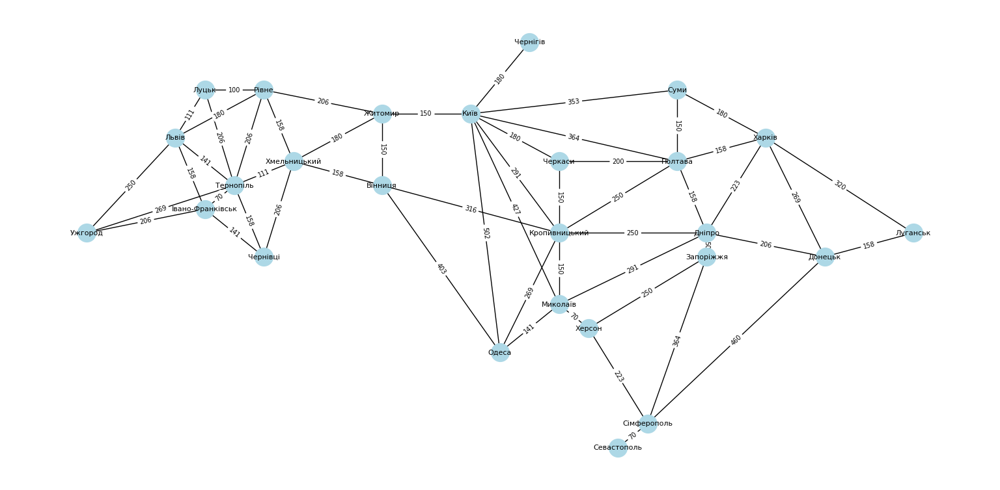

# GoITNeo Algo HW-6

## Task1
Create a graph using the networkX library to model a specific real-world network (such as a city's transportation network, social network, internet topology).
Visualize the created graph and make an analysis of its key characteristics (e.g., number of nodes and edges, node degrees).

### Solution
Let's make a graph of Ukraine's main cities and their roads. We will add attribute "pos" to locate each city on it's proper place.
We have a class UkraineRoads in file main.py.
So, we have printed information about and a picture of the graph:
```
Number of cities: 26
Number of roads: 54
Centrality:
  Київ             0.32
  Луцьк            0.12
  Рівне            0.2
  Житомир          0.16
  Чернігів         0.04
  Суми             0.12
  Львів            0.2
  Тернопіль        0.28
  Хмельницький     0.2
  Вінниця          0.16
  Івано-Франківськ 0.16
  Ужгород          0.12
  Чернівці         0.12
  Черкаси          0.12
  Полтава          0.24
  Харків           0.2
  Кропивницький    0.28
  Дніпро           0.24
  Запоріжжя        0.12
  Донецьк          0.16
  Луганськ         0.08
  Одеса            0.16
  Миколаїв         0.2
  Херсон           0.12
  Сімферополь      0.16
  Севастополь      0.04
```


## Task2
Write a program that utilizes the DFS and BFS algorithms to find paths in the graph created in the first task.
Compare the results of executing both algorithms for this graph, highlighting the differences in the obtained paths. Explain why the paths for the algorithms are as they are.

### Solution
We have class UkraineRoads, let's add two methods DFS() and BFS() for corresponding algorithms.
Here is visit-order from both flows ("Київ" - is start point for both):
```
> DFS visit order: Київ, Миколаїв, Херсон, Сімферополь, Севастополь, Донецьк, Луганськ, Харків, Дніпро, Запоріжжя, Кропивницький, Одеса, Вінниця, Хмельницький, Чернівці, Івано-Франківськ, Ужгород, Тернопіль, Львів, Рівне, Житомир, Луцьк, Полтава, Черкаси, Суми, Чернігів
> BFS visit order: Київ, Черкаси, Чернігів, Кропивницький, Житомир, Миколаїв, Одеса, Суми, Полтава, Дніпро, Вінниця, Рівне, Хмельницький, Херсон, Харків, Запоріжжя, Донецьк, Львів, Луцьк, Тернопіль, Чернівці, Сімферополь, Луганськ, Ужгород, Івано-Франківськ, Севастополь
```
We can see the difference from the very beginning:
 - DFS: iteratively takes the first neighbor and deep dive to the bottom of the graph until visited all nodes. This flow is good to fast and easy find a path between two nodes. But it can be not the best one.
 - BSF: checks all neighbors for current node and only after that iteratively steps down to neighbors-of-neighbors and so on. This algorithm takes more time to, but can be used for different tasks like find the shortest path between two nodes.

We have to remember each algorithm's pros and cons and decide which should be used based on the task and resources we have.

## Task3
Implement Dijkstra's algorithm to find the shortest path in the developed graph: add weights to the edges of the graph and find the shortest path between all vertices of the graph.
